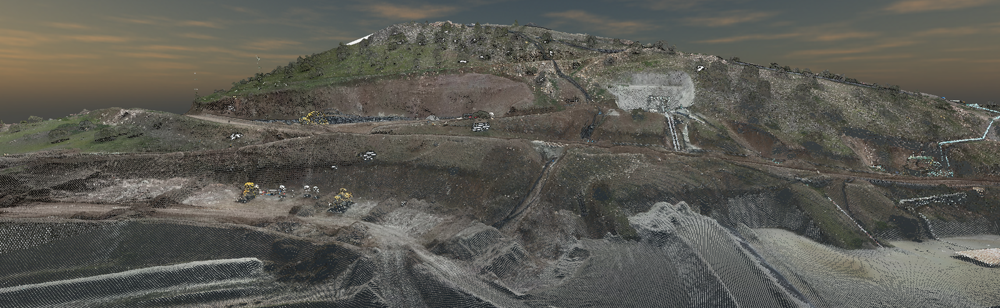
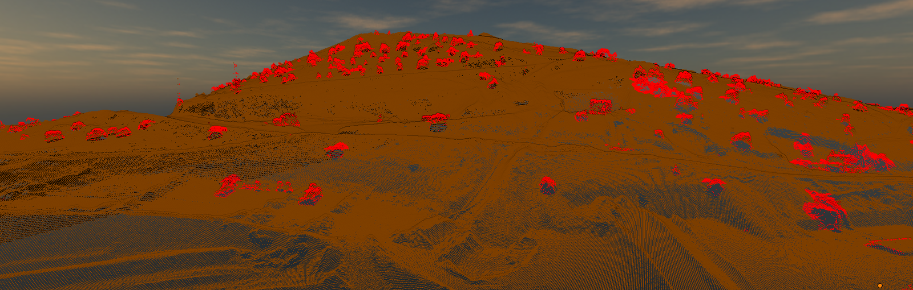
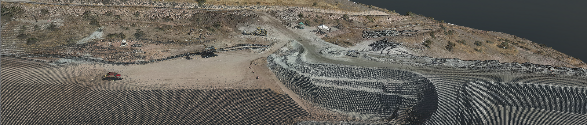
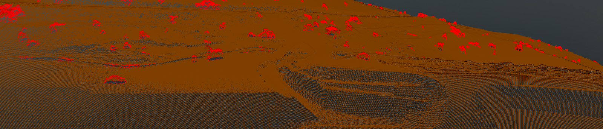

# Cloud Point Research V2 — Portafolio Técnico

Proyecto de investigación y desarrollo en GeoAI: segmentación binaria (maquinaria vs. suelo) sobre nubes fotogramétricas. Este repositorio es una muestra de trabajo técnico (no un paquete listo para uso externo). Enfocado en reproducibilidad experimental, MLOps y optimización de throughput para producción.


Resultados de segmentación (RGB vs Clasificado)

Escena 1

<table>
<tr>
<th width="50%">RGB</th>
<th width="50%">Segmentación</th>
</tr>
<tr>
<td></td>
<td></td>
</tr>
</table>

Escena 2

<table>
<tr>
<th width="50%">RGB</th>
<th width="50%">Segmentación</th>
</tr>
<tr>
<td></td>
<td></td>
</tr>
</table>


**Estado:** Modelo V6 (Resolution Sync, 0.25m) validado y listo para despliegue local.

**Resumen técnico — puntos clave:**
- **Arquitectura:** PointNet++ MSG (entrada: XYZ + RGB + Normals, d_in = 9)
- **Estrategia:** Sincronizar resolución de entrenamiento/inferencia a 0.25 m ("Resolution Sync") para eliminar domain-gap.
- **Datos:** bloques 10x10 m procesados en `data/processed/blocks_10m V6`.
- **Puntos por muestra:** 2048 (evaluado para densidad 0.25m).
- **Clase desequilibrada:** uso de `class_weights` (ej. [1.0, 15.0]) y oversampling de maquinaria para estabilidad.

**Métricas V6 (mejor corrida validada)**
- **mIoU (val):** 93.06%
- **IoU Maquinaria:** 87.67% (mejor histórico 88.85%)
- **IoU Suelo:** 98.46%
- **Val Loss:** 0.0227

Detalles completos en: [docs/TECHNICAL_REPORT_V6.md](docs/TECHNICAL_REPORT_V6.md)

**Hardware y entorno de entrenamiento**
- **GPU:** RTX 5090 (entreno en CUDA, Torch + FP16 soporte)
- **Parámetros sys:** `num_workers=8`, `pin_memory=True`
- **Entrenamiento:** 75 epochs, `batch_size=64`, `num_points=2048`, `learning_rate≈0.001`, `base_radius=3.5m`.

**MLOps / Reproducibilidad**
- Experimentos y sweeps con Weights & Biases (`project: Tortolas-segmentation`, `entity: tito-ruiz-haros`).
- Configs versionadas: `configs/pointnet2/pointnet2_v6_0.25m.yaml`, sweeps en `configs/pointnet2/sweep_v6_0.25m.yaml`.
- Checkpoints guardados en `checkpoints/` con metadata de run (logs wandb en `wandb/`).

**Técnicas y optimizaciones aplicadas**
- PointNet++ MSG para robustez multi-escala.
- Data-centric: resolución y bloqueo espacial (10x10 m) para consistencia geométrica.
- Mining de ejemplos difíciles y pesos de clase para abordar la rareza de maquinaria.
- Inferencia optimizada: Torch Compile, FP16, gridding vectorizado y cálculo de normales on-the-fly.

**Proceso de anotación y flujo de trabajo (workflow)**
- **Clasificación manual primero:** etiquetado manual y reglas heurísticas para bootstrap.
- Dataset curado y balanceado (sobremuestreo de maquinaria y verificación visual).
- Entrenamiento → evaluación (mIoU/IoU por clase) → sweep de hiperparámetros → checkpoint final.

**Resultados de inferencia (ejemplo)**
- Procesamiento: 5,581 bloques → ~58 segundos (pipeline optimizado, batch inference).

**Comandos rápidos (reproducir / inferir)**

Reproducir entrenamiento V6 (ejemplo):

```bash
python3 TRAIN_V6.py --config configs/pointnet2/pointnet2_v6_0.25m.yaml
```

Inferencia (ejemplo):

```bash
python3 scripts/inference/infer_pointnet_v6.py \
  --input_file "data/raw_test/RGB/entrada_0.25.laz" \
  --checkpoint "checkpoints/SWEEP_RTX 5090 PointNet2 V6 (0.25m)/BEST_IOU.pth" \
  --output_file "data/predictions_v6/salida.laz" \
  --batch_size 64 \
  --confidence 0.8
```
